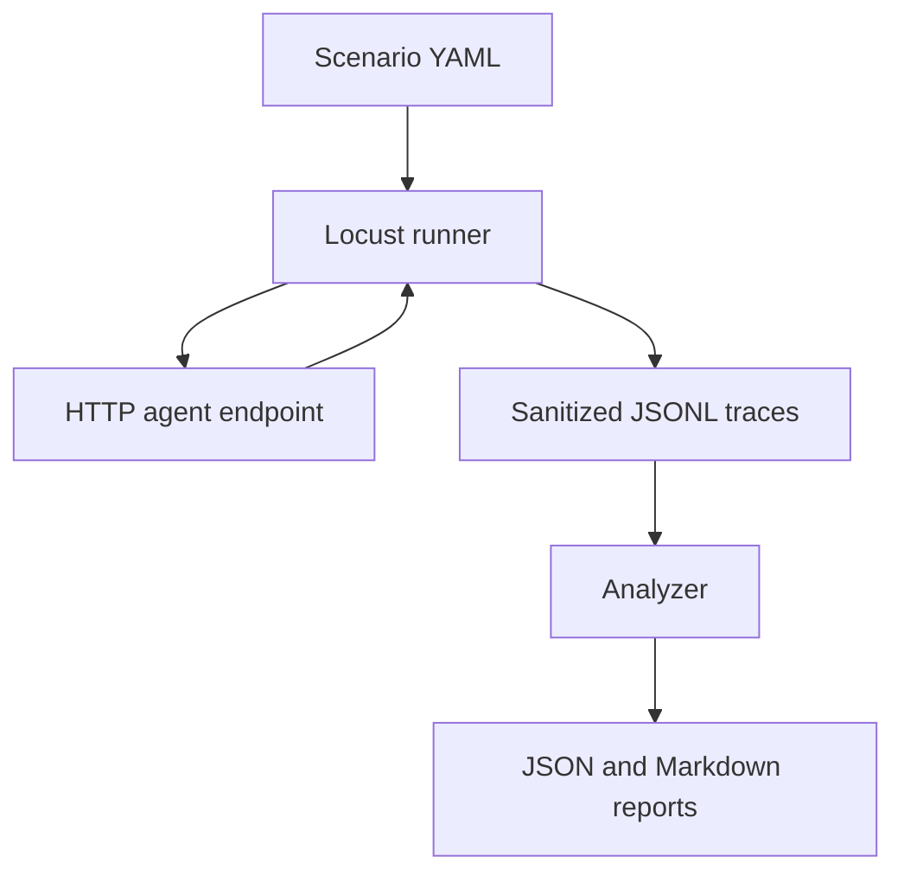
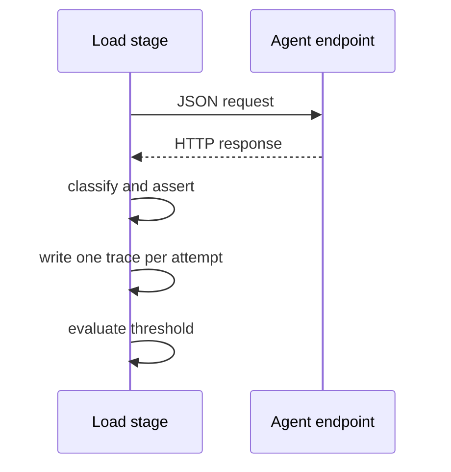

# AgentLoad

AgentLoad finds the first tested concurrency level where an HTTP agent falls below its required task-success rate.

## Project result

AgentLoad runs each configured concurrency level with Locust, classifies each completed HTTP task, and writes sanitized JSONL traces with JSON and Markdown summaries. A breaking point is the first tested level with task success below `success_threshold`.





## Measured deterministic demo

The CI acceptance test runs the local deterministic simulator with stages `1` and `4`. The measured synthetic result is:

| Measurement | Result |
| --- | ---: |
| Highest passing concurrency | 1 |
| Breaking point | 4 |
| Normal CLI exit | 0 |
| Threshold-enforced exit | 4 |

This is synthetic behavior from `examples/mock_agent.py`. It is verified in [GitHub Actions run 33181148767](https://github.com/ss1738/AgentLoad/actions/runs/33181148767). It is not a production benchmark or evidence of market demand.

## Metrics

Each report level includes attempts, successful and failed tasks, task-success rate, successful tasks per minute, p50 and p95 latency, total tokens, total cost, cost per successful task, HTTP 429 rate, timeout rate, maximum loop depth, and failure counts and rates.

## Installation

```bash
python3 -m pip install .
```

For a source checkout and the simulator:

```bash
python3 -m pip install -e '.[demo]'
```

## Quick start

Start the deterministic simulator in one terminal:

```bash
python3 -m uvicorn examples.mock_agent:app --host 127.0.0.1 --port 8000
```

Run the small scenario from another terminal:

```bash
agentload run examples/quick-scenario.yaml --host http://127.0.0.1:8000 --output agentload-results
```

Add `--fail-under-threshold` when a detected breaking point must make the command exit with code `4`.

## Scenario schema

```yaml
name: support-agent-reliability
endpoint: /agent
concurrency: [1, 10, 25]
duration_seconds: 20
spawn_rate: 10
success_threshold: 0.90
tasks:
  - prompt: "sanitized task input"
assertions:
  success_field: success
  required_value: true
  max_cost_usd: 0.05
  max_loop_depth: 5
  expected_tool_call: lookup
  max_latency_ms: 1000
```

Required keys are `name`, `endpoint`, `concurrency`, `duration_seconds`, `spawn_rate`, `success_threshold`, `tasks`, and `assertions`. `concurrency` must be a non-empty unique list of positive integers. Every task needs a string `prompt`. The optional assertion keys are `max_cost_usd`, `max_loop_depth`, `expected_tool_call`, and `max_latency_ms`.

## Response schema

AgentLoad expects a JSON object. Only fields used by the selected assertions and metrics are needed.

```json
{
  "success": true,
  "input_tokens": 120,
  "output_tokens": 60,
  "estimated_cost_usd": 0.003,
  "tool_calls": ["lookup"],
  "loop_depth": 1
}
```

## Output layout

```text
agentload-results/
  traces.jsonl
  report.json
  report.md
  stages/
    concurrency-1.jsonl
    concurrency-1.meta.json
```

Each stage metadata file records configured and observed duration, UTC start and end times, spawn rate, completion status, exit code, relative trace path, trace count, and an optional failure reason. A trace contains concurrency, latency, HTTP status, success state, token and cost counters, tool count, loop depth, failure category, and a sanitized error message.

## JSON report fields

The runner writes report version `0.2`, scenario name, success threshold, breaking point, highest passing concurrency, aggregate trace count, an incomplete-stage warning, and `levels`. Each level contains the metrics listed above.

`agentload analyze OUTPUT_DIRECTORY --threshold 0.90` reads paired stage files and produces a stage-aware report with `stages` and `incomplete_stages`. It rejects missing pairs, concurrency mismatches, and trace-count mismatches.

## Markdown report interpretation

The Markdown report presents one row per tested concurrency. The breaking-point line means that the measured task-success rate at that tested level was below the required threshold. It does not predict behavior at untested levels.

## Failure taxonomy

`success`, `http_429`, `http_4xx`, `http_5xx`, `timeout`, `connection_error`, `invalid_json`, `success_assertion_failed`, `cost_limit_exceeded`, `loop_limit_exceeded`, `latency_limit_exceeded`, and `unknown_error` are retained as failure categories. HTTP status classification has precedence over JSON and semantic assertions.

## Exit codes

| Code | Meaning |
| ---: | --- |
| 0 | Command completed without threshold enforcement failure. |
| 2 | Invalid scenario or invalid CLI input. |
| 3 | Execution or report-reading failure. |
| 4 | A breaking point was found while `--fail-under-threshold` was requested. |

## CI usage

```bash
agentload run scenario.yaml --host http://staging.example --output agentload-results --fail-under-threshold
```

The repository CI runs the unit suite and a real local Uvicorn acceptance test on Python 3.10, 3.11, 3.12, and 3.13. The acceptance test requires execution with `AGENTLOAD_REQUIRE_E2E=1`.

## Privacy and sanitization

AgentLoad does not store prompts, response bodies, authorization headers, or environment values in its traces. Error messages are reduced to one line and capped at 240 characters. Do not place credentials or user data in scenarios, fixtures, issue reports, or generated outputs.

## Limitations

AgentLoad measures the configured HTTP requests and deterministic assertions only. It does not perform semantic judging, inspect streaming transport behavior, replace security testing, or prove agent correctness. A result applies only to the tested inputs, target, and concurrency levels.

## Development

```bash
python3 -m venv .venv
.venv/bin/python3 -m pip install -e '.[test,demo]'
.venv/bin/python3 -m compileall -q agentload examples tests
AGENTLOAD_REQUIRE_E2E=1 .venv/bin/pytest -q -rs
```

Build distributions without publishing them:

```bash
python3 -m pip install '.[build]'
python3 -m build
```

## Roadmap

Future work is limited to evidence-backed changes. Streaming transport measurement research remains separate from the current hardening branch.

## License

[MIT](LICENSE).
